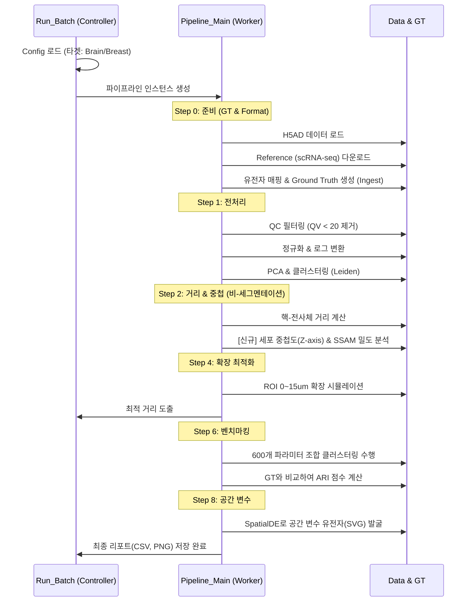

# 파이프라인 심층 분석 보고서 (Pipeline Technical Deep Dive)

본 문서는 파이프라인이 **실제로 어떻게 작동하는지**, 특히 사용자가 고민했던 **ROI(Region of Interest) 계산**과 **Ground Truth(정답지) 생성** 로직을 중심으로 코드 레벨의 실행 흐름을 상세히 설명합니다.

---

## 1. Ground Truth는 어떻게 만들어지는가? (Step 0)
Ground Truth(GT)는 벤치마킹의 기준이 되는 '정답 세포 유형'을 의미합니다. 우리 파이프라인은 외부의 **scRNA-seq 레퍼런스 데이터**를 활용하여 Xenium 데이터에 라벨을 입히는 방식을 사용합니다.

### 1.1 실행 흐름 (`step7_ground_truth.py`)
1.  **레퍼런스 다운로드 (`download_reference_data`)**
    *   `config.yaml`에 정의된 `tissue_type` (예: 'brain', 'breast')에 맞춰 **Cellxgene Census** 데이터베이스에서 검증된 scRNA-seq 데이터를 다운로드합니다.
    *   이 데이터는 전문가가 이미 주석(Annotation)을 달아놓은 고품질 데이터입니다.

2.  **유전자 매핑 및 교차 (Crucial Step)**
    *   **문제점**: scRNA-seq는 'Ensembl ID'(예: ENSG0001)를 쓰고, Xenium은 'Gene Symbol'(예: EGFR)을 쓸 수 있어 매칭이 안 될 수 있습니다.
    *   **해결 로직**:
        *   두 데이터셋의 `var_names` (유전자 이름)를 비교합니다.
        *   만약 형식이 다르면, scRNA-seq 데이터 내부의 메타데이터(`feature_name` 등)를 뒤져서 Xenium과 동일한 형식(Symbol)으로 변환합니다.
        *   최종적으로 두 데이터셋에 **공통으로 존재하는 유전자(Intersection)**만 남기고 나머지는 필터링하여 노이즈를 제거합니다.

3.  **라벨 전이 (Label Transfer via Ingest)**
    *   `scanpy.tl.ingest` 알고리즘을 사용합니다.
    *   scRNA-seq 데이터(Reference)를 기반으로 학습된 분류기를 사용하여, Xenium 공간 데이터(Target)의 각 세포가 어떤 유형에 가장 가까운지 예측하여 `ground_truth_celltype` 컬럼에 저장합니다.
    *   이 결과가 이후 모든 벤치마킹(ARI 계산 등)의 **정답지** 역할을 합니다.

---

## 2. ROI와 거리 계산은 어떻게 이루어지는가? (Step 2 & 4)
사용자가 고민했던 **ROI(관심 영역)**와 관련된 로직은 크게 '세그멘테이션 없는 거리 분석'과 '세포 경계 확장 최적화' 두 가지로 구현되어 있습니다.

### 2.1 핵 중심 거리 계산 (`step2_segmentation_free`)
*   **목적**: 세포 경계(Segmentation)가 부정확할 때, 핵(Nucleus)을 기준으로 유전자가 얼마나 퍼져있는지(Dispersion) 확인.
*   **알고리즘**:
    1.  `adata.obs`에 있는 각 세포의 핵 중심 좌표(`x_centroid`, `y_centroid`)를 가져옵니다.
    2.  모든 개별 전사체(Transcript)의 좌표(`x_location`, `y_location`)와의 **유클리드 거리(Euclidean Distance)**를 계산합니다.
    3.  단순히 가까운 세포에 할당하는 것이 아니라, **가장 가까운 핵까지의 거리 분포**를 유전자별로 집계합니다.
    4.  결과: "Gene A는 주로 핵 근처(0~2µm)에 있다", "Gene B는 멀리(5µm 이상) 퍼져 있다"는 식의 통계를 도출합니다.

### 2.2 ROI 확장 최적화 (`step4_optimal_expansion`)
*   **목적**: Xenium이 제공하는 기본 세포 경계(ROI)는 너무 좁거나 넓을 수 있습니다. 최적의 ROI 크기를 찾습니다.
*   **알고리즘 (시뮬레이션 루프)**:
    1.  **기본 ROI**: 제공된 세포 경계(Cell Boundary)에서 시작합니다.
    2.  **확장 (Expansion)**: 경계를 0µm에서 15µm까지 **0.5µm 단위로 점점 넓혀봅니다.**
    3.  **Purity vs Capture 측정**:
        *   **Capture (포획률)**: 넓힐수록 더 많은 전사체가 세포 안으로 들어옵니다. (ROI 내 전사체 수 증가)
        *   **Purity (순도)**: 너무 넓히면 남의 세포 유전자가 섞입니다. 이를 감지하기 위해 '핵 내부 전사체 비율' 등을 순도(Proxy Purity) 지표로 사용합니다.
    4.  **결정**: 순도가 급격히 떨어지기 직전(Elbow Point)의 거리를 **최적의 ROI 확장 거리**로 제안합니다.

---

## 3. 전체 파이프라인 실행 흐름 (Execution Flow)

## 4. 요약
*   **Ground Truth**: 외부 전문가 데이터(scRNA-seq)를 가져와 내 데이터에 **"이식(Ingest)"**하여 만듭니다. 유전자 이름 매칭이 핵심 기술입니다.
*   **ROI**: 고정된 값이 아니라, **거리를 재고(Step 2), 넓혀보며(Step 4) 최적의 크기를 찾아가는 과정**으로 구현되어 있습니다.
